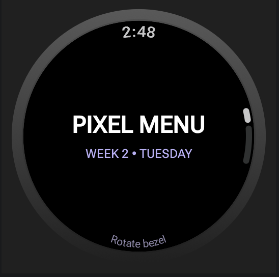
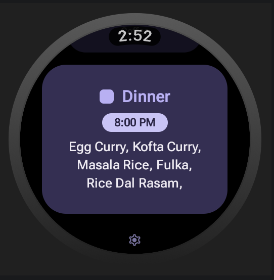

# NukeMenu

A simple Wear OS app for checking the canteen menu directly from your smartwatch.

Currently supports the **Pixel Canteen at PES University, ECC**.

## Screenshots

  
  

## Setup

Pick the ongoing #Week and the app autodetects the day.

## Features

- View the daily canteen menu
- Designed for Wear OS
- Simple and lightweight interface
- Daily Meal Notification
- Edit Menu Mistakes

## Tech Stack

- Kotlin
- Jetpack Compose
- Wear OS

## Status

**Initial Release**

The menu is currently hardcoded. Menu errors will be fixed and updated gradually.

## Download

The .apk is provided under Github Release, and can be sideloaded with a 3rd party phone application or a laptop.

Orrr lwk just give me your watch i'll set it up for you

## Contact

nukestudios.dev@gmail.com

PESU ECC

Bengaluru, India